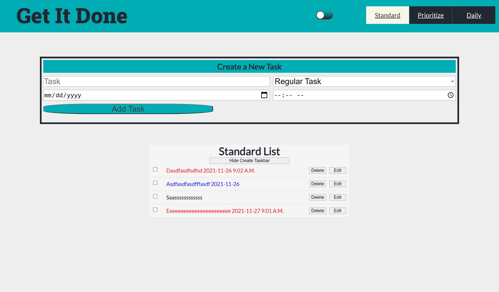
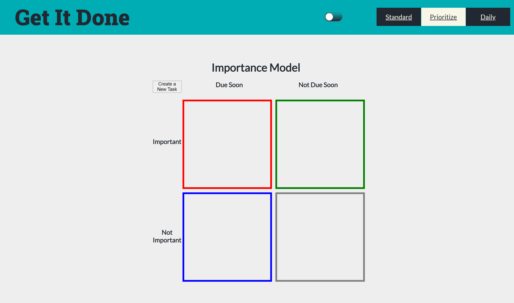
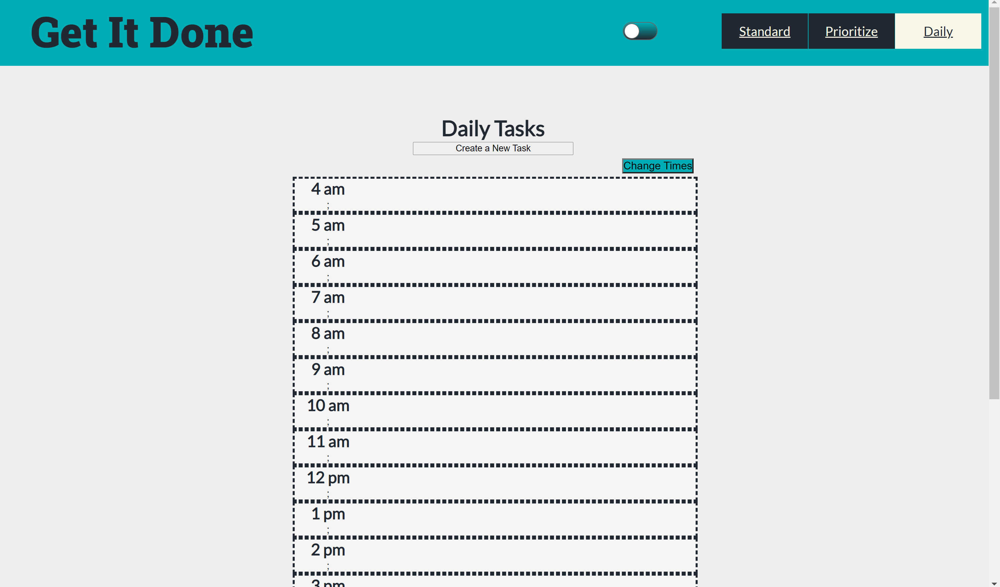

# GET-It-DONE

Hi! - welcome to _GET-IT-DONE_!

I provide you with three different types of to do lists. 

## Standard List

## Prioritizing List

## Day Planner

### Tools used

_Get-IT-DONE_ is built with react.  I used hooks for most of the functionality and styled components for the css.

### How to get started

**Clone the repo**

**cd get-it-done**

**npm install**

**npm run start**

### Coming soon

* [ ] Authentication
* [ ] Ability to save your lists
* [ ] Ability to drag and drop tasks to sort your lists
